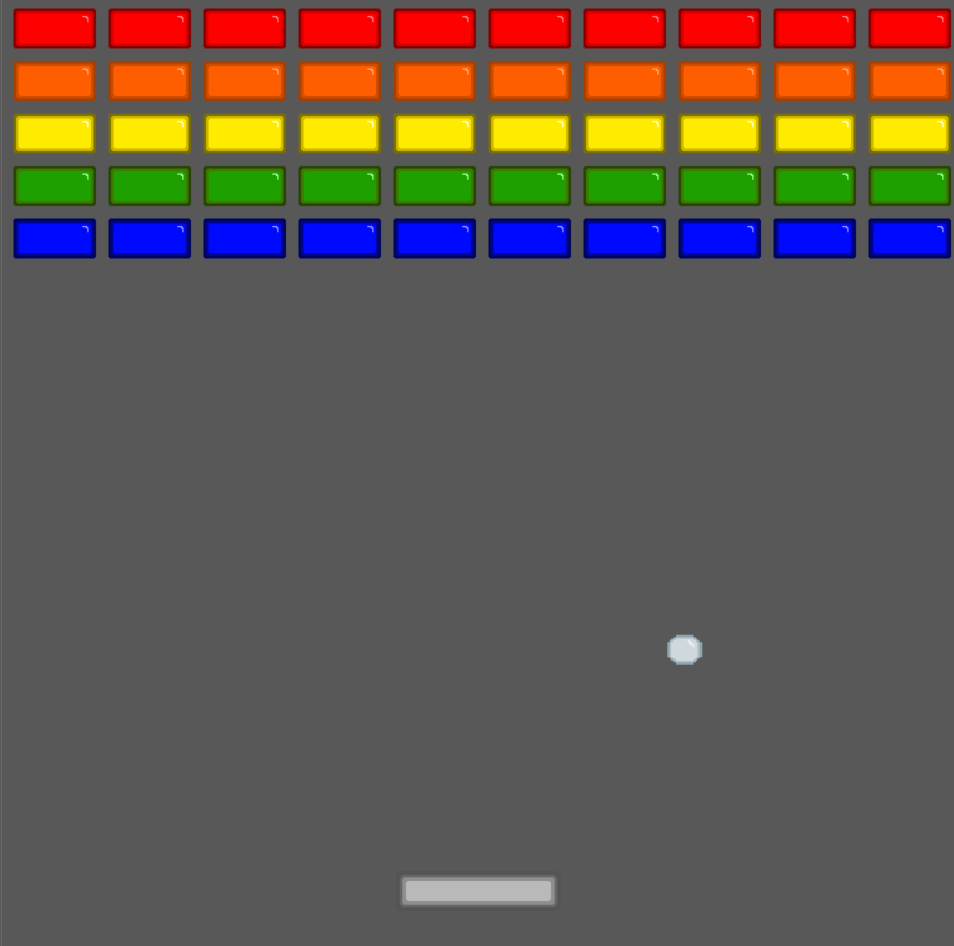

# Blockify
## break the blocks and unlock more themes!

### A little 2D game, written in Python with pygame in school, where you can shoot against blocks so that they break. Like a typical block breaker game.

### Ingame Screenshoot

#### Controls:
left and right arrow keys to navigate the platform.
