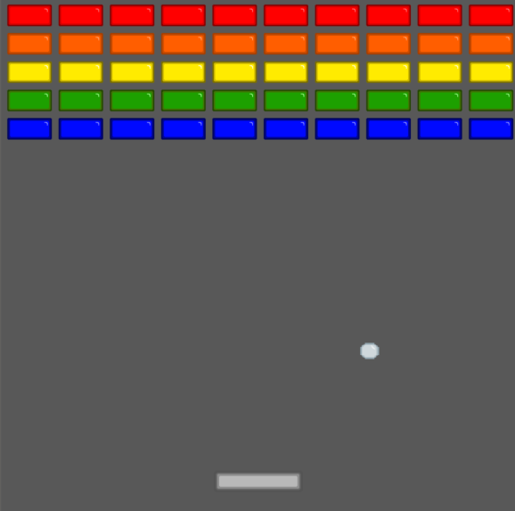

# Blockify
### A little Block Breaker Minigame

### School-Project

### A little 2D game, written in Python with pygame at school, where you shoot against blocks so that they break. Like a typical block breaker game.

⚠️ NOT 100% PLAYABLE/FINISHED ⚠️

### Ingame Screenshoot

#### Controls:
Left and right arrow keys to navigate the platform.
